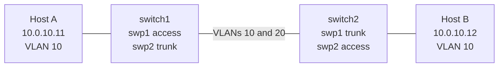
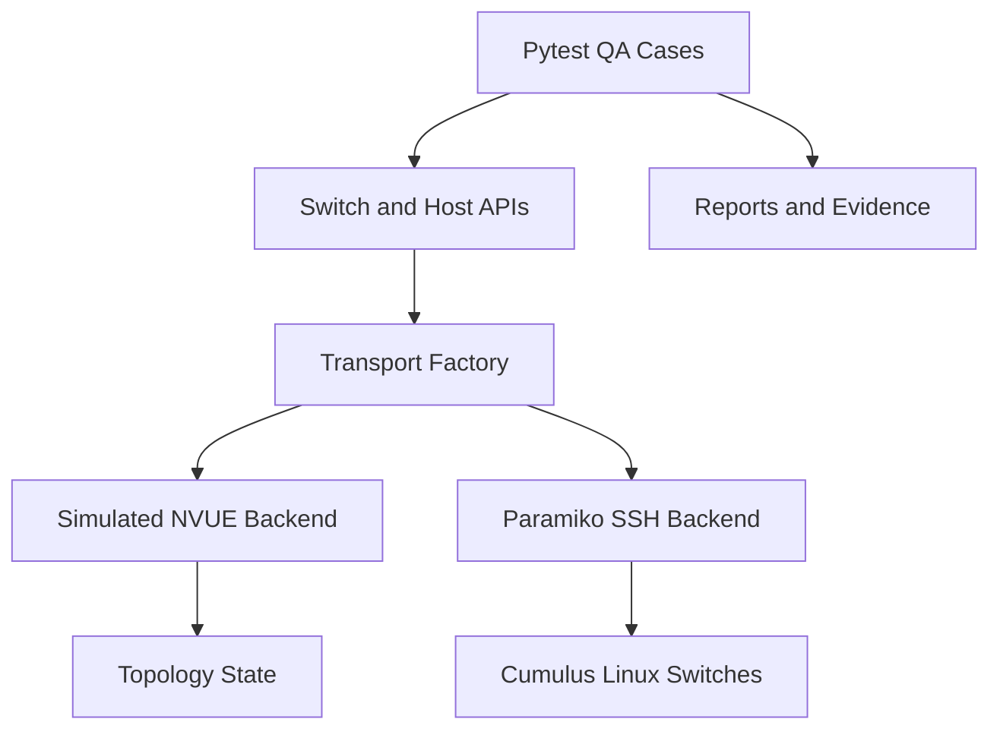

# Cumulus Switch QA Automation

[](https://github.com/Gopal3746/switch-QA-automation/actions/workflows/qa-tests.yml)

A Python and Pytest automation framework for validating VLAN configuration, switch-port state, configuration persistence, and end-to-end connectivity across a two-switch NVIDIA Cumulus Linux/NVUE topology.

The project supports deterministic simulation for local development and CI, plus a Paramiko-based SSH backend for compatible lab switches.

## Results

- 13 requirement-linked network QA cases
- 59 automated framework and QA tests
- Functional, security, performance, negative, and regression coverage
- Two deliberately injected configuration defects
- JSON and Markdown execution summaries
- Automatic diagnostic evidence for failed QA cases
- GitHub Actions validation on pushes and pull requests

## Topology



The expected topology is defined in `configs/topology.yaml`. Test-to-requirement traceability is defined in `configs/test_matrix.yaml`.

## Architecture



The device APIs are independent of the selected command transport. Tests interact with `Switch` and `Host` objects while the transport factory selects either deterministic simulation or live SSH.

See [Architecture](docs/ARCHITECTURE.md) for additional details.

## Test coverage

| Area | Coverage |
|---|---|
| VLAN | Access PVID, trunk membership, isolation, and injected VLAN defects |
| Port state | Administrative transitions and trunk peer state |
| Connectivity | Reachability, packet loss, and negative connectivity |
| Persistence | Saved configuration after reload |
| Recovery | Connectivity after correcting both injected defects |
| Framework | Configuration, transports, simulation, devices, diagnostics, and reporting |

The complete 13-case plan is documented in [Test Plan](docs/TEST_PLAN.md).

## Project structure

```text
.
├── .github/workflows/qa-tests.yml
├── configs/
│   ├── test_matrix.yaml
│   └── topology.yaml
├── docs/
│   ├── ARCHITECTURE.md
│   ├── DEFECT_REPORTS.md
│   └── TEST_PLAN.md
├── reports/
│   └── evidence/
├── src/switch_qa/
│   ├── backend.py
│   ├── config.py
│   ├── devices.py
│   ├── diagnostics.py
│   ├── reporter.py
│   ├── simulated_transport.py
│   ├── simulation.py
│   └── transport.py
└── tests/
    ├── qa/
    └── test_*.py
```

## Development setup

Python 3.12 or later is recommended.

```bash
git clone https://github.com/Gopal3746/switch-QA-automation.git
cd switch-QA-automation

python3.12 -m venv .venv
source .venv/bin/activate

python -m pip install --upgrade pip
python -m pip install -e ".[dev]"
```

## Run the simulated suite

Simulation is the default backend and requires no network hardware:

```bash
python -m pytest
```

Run only the 13-case QA plan:

```bash
python -m pytest tests/qa -v
```

Run linting:

```bash
python -m ruff check .
```

Run with coverage and JUnit output:

```bash
python -m pytest \
  --cov=switch_qa \
  --cov-report=term-missing \
  --cov-report=xml \
  --junitxml=reports/junit.xml
```

## Run against live switches

Set the connection details referenced by `configs/topology.yaml`:

```bash
export SWITCH1_HOST="192.0.2.10"
export SWITCH1_USER="cumulus"
export SWITCH1_SSH_KEY="$HOME/.ssh/cumulus_lab"

export SWITCH2_HOST="192.0.2.11"
export SWITCH2_USER="cumulus"
export SWITCH2_SSH_KEY="$HOME/.ssh/cumulus_lab"
```

Password authentication is also supported through optional variables:

```bash
export SWITCH1_PASSWORD="switch1-password"
export SWITCH2_PASSWORD="switch2-password"
```

Run the QA suite through SSH:

```bash
python -m pytest tests/qa --backend=ssh -v
```

Seven state-changing or defect-injection cases are marked `simulation_only` and are skipped against live switches by default. The remaining VLAN and connectivity checks execute through the same device APIs using the SSH transport.

Strict SSH host-key checking is enabled by default. For an isolated disposable lab only, unknown keys can be permitted explicitly:

```bash
python -m pytest tests/qa \
  --backend=ssh \
  --accept-unknown-host-keys
```

Credentials and private keys must never be committed to the repository.

## Reports and failure evidence

Every QA execution creates:

```text
reports/summary.json
reports/summary.md
```

When a requirement-linked case fails, the evidence collector captures relevant output such as:

- `nv show interface`
- `bridge vlan show`
- `ip link`
- `ip route`
- `ping`

Evidence bundles are stored under `reports/evidence/`. CI uploads reports, coverage output, JUnit results, and failure evidence as workflow artifacts.

## Injected defects

The simulator deliberately models two configuration defects:

1. VLAN 10 missing from the `switch2` trunk.
2. `switch1` access-port PVID set to VLAN 20 instead of VLAN 10.

The negative tests detect both conditions, while the recovery test corrects them and verifies restored connectivity.

See [Defect Reports](docs/DEFECT_REPORTS.md) for the root-cause analysis and verification steps.

## Continuous integration

GitHub Actions runs on pushes and pull requests to:

1. Install the project and development dependencies.
2. Run Ruff static analysis.
3. Execute all framework and QA tests.
4. Generate coverage and JUnit reports.
5. Verify that all 13 QA cases were collected.
6. Upload reports and diagnostic evidence.

## Documentation

- [Architecture](docs/ARCHITECTURE.md)
- [13-Case Test Plan](docs/TEST_PLAN.md)
- [Injected Defect Reports](docs/DEFECT_REPORTS.md)

## Disclaimer

This is an independent educational QA automation project. It is not an NVIDIA product and is not affiliated with or endorsed by NVIDIA.
