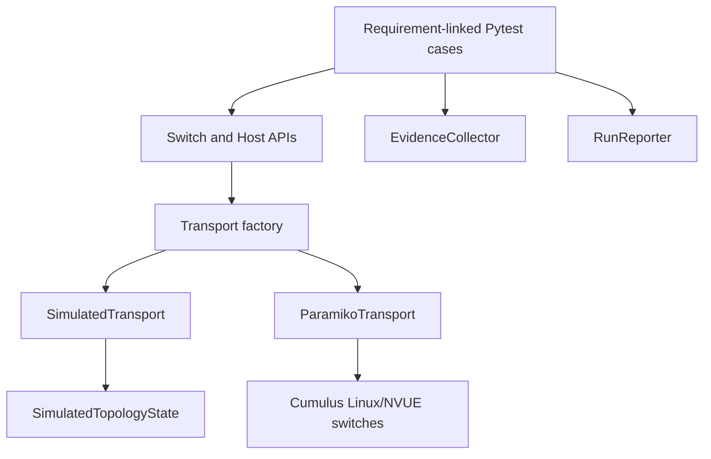

# Architecture

## Objective

The framework separates QA intent from command execution so the same device APIs can operate over deterministic simulation or SSH-connected Cumulus Linux switches.

## Component flow



## Components

| Component | Responsibility |
|---|---|
| `config.py` | Loads and validates topology YAML and expands environment variables |
| `backend.py` | Selects simulated or SSH transport at runtime |
| `transport.py` | Defines the transport protocol and Paramiko implementation |
| `simulation.py` | Stores switch, port, VLAN, and reachability state |
| `simulated_transport.py` | Converts NVUE/Linux commands into deterministic simulated responses |
| `devices.py` | Exposes high-level switch and host operations |
| `diagnostics.py` | Collects structured command and ping evidence |
| `reporter.py` | Generates JSON and Markdown execution summaries |
| `tests/qa/` | Implements the 13 requirement-linked QA cases |

## Transport boundary

Both backends implement the `CommandTransport` protocol:

```python
class CommandTransport(Protocol):
    def connect(self) -> None: ...
    def disconnect(self) -> None: ...
    def run_command(
        self,
        command: str,
        *,
        timeout: float = 15.0,
        check: bool = False,
    ) -> CommandResult: ...
```

Device objects therefore do not need to know whether commands are executed by a simulator or over SSH.

## Backend selection

The default execution mode is:

```bash
python -m pytest tests/qa --backend=simulated
```

Live execution uses:

```bash
python -m pytest tests/qa --backend=ssh
```

The topology file supplies addresses, users, and key paths through environment-variable placeholders. Optional passwords are read from `SWITCH1_PASSWORD` and `SWITCH2_PASSWORD`.

## Live-test safety

Tests that modify port state, inject defects, reload configuration, or apply corrective changes are marked `simulation_only`. Pytest automatically skips these tests when `--backend=ssh` is selected.

Strict SSH host-key checking is enabled by default. Accepting unknown host keys requires an explicit command-line flag.

## Diagnostics flow

When a requirement-linked test fails:

1. Pytest identifies the case through its `test_id` marker.
2. Available switch and host fixtures are collected.
3. `EvidenceCollector` runs diagnostic commands.
4. Results and failure details are saved under `reports/evidence/`.
5. `RunReporter` links the evidence path to the failed case.
6. GitHub Actions uploads the evidence as an artifact.

## Traceability

`configs/test_matrix.yaml` maps each test ID to:

- Pytest node ID
- Category
- Validation area
- Documented requirement

The reporter uses this matrix to generate execution summaries ordered from TC-01 through TC-13.
